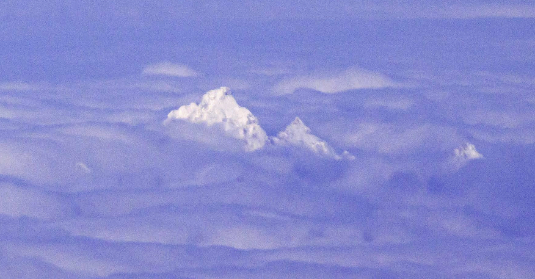

UMT Introduction
==================



UMT (Unstructured Mesh Transport) is an LLNL ASC proxy application (mini-app)
that solves a thermal radiative transport equation using discrete ordinates
(Sn).  It utilizes an upstream corner balance method to compute the solution to
the Boltzmann transport equation on unstructured spatial grids.

This class of problems is characterized by tens of thousands of unknowns
per zone and upwards of millions of zones, thus requiring large, scalable,
parallel computing platforms with tens of processors per node.

To achieve scalability, the application exploits both spatial decomposition
using message passing between nodes and a threading algorithm across angles
and energy groups across processors within the node.  More recent versions of
UMT are also capable of utilizing both CPUs and GPUs on heterogeneous platforms.

The code is primarily written in Fortran 2003 with some C++ and Cuda.

Building
===============

UMT uses the [CMake](https://cmake.org/) build system.  A MPI compiler is
required.

More information on building UMT can be found in BUILDING.md

Third party libraries
-----------------------
UMT depends on several libraries, some of them optionally. See the DEPENDENCIES.md file for more information.

Test problems
===============
UMT includes an unstructured mesh 3d test problem using a [MFEM](https://mfem.org/) mesh
This mesh can be refined using MFEM at run time to provide larger problems.

To run this problem:
1. Build UMT.  This will produce a test_driver and makeUnstructuredBox executable.
2. Run the makeUnstructuredBox to produce the 3d test mesh.
```
srun -n1 /path/to/install/bin/makeUnstructuredBox
```
3. Run the test driver.  In the below example the problem will run for 10 cycles and the mesh will be refined.  Run 'test_driver -h' for more info on the arguments.
```
srun -n2 path/to/install/bin/test_driver -i ./unstructBox3D.mesh -c 10 -r 1 -R 6
```

References
==============
* Nemanic, M K, and Nowak, P. "Radiation transport calculations on unstructured
  grids using a spatially decomposed and threaded algorithm". United States: N.
  p., 1999. https://www.osti.gov/servlets/purl/14136

* Nowak, P. "Deterministic Methods for Radiation Transport: Lessons Learned and
  Future Directions." United States: N. p., 2004.
  https://www.osti.gov/servlets/purl/15014024

* Howell, Louis H., Gunney, Brian T., and Bhatele, Abhinav. "Characterization of
  Proxy Application Performance on Advanced Architectures. UMT2013, MCB,
  AMG2013." United States: N. p., 2015. Web. doi:10.2172/1224409.

* Maginot, P G, Nowak, P F, and Adams, M L. "A Review of the Upstream Corner
  Balance Spatial Discretization". United States: N. p., 2017,
  https://www.osti.gov/servlets/purl/1357379

* Thomas A. Brunner, Terry S. Haut & Paul F. Nowak "Nonlinear Elimination
  Applied to Radiation Diffusion", Nuclear Science and Engineering, 2020,
  194:11, 939-951, DOI: 10.1080/00295639.2020.1747262

* P. Nowak, A. Black, S. Rennich, D. Appelhans, R. Chen, T.  Haut, P. Maginot,
  T. Bailey, P. Brown, A. Kunen, J. Loffeld, B. Tagani, "Porting Teton, a
  Discrete-Ordinates Thermal Radiative Transfer Code, to Sierra",
  Proceedings, M&C 2019, Portland, OR, August 25-29, 2019, Pages 2128-2137

* Steven J. Plimpton, Bruce Hendrickson, Shawn P. Burns, William McLendon III &
  Lawrence Rauchwerger (2005) "Parallel Sn Sweeps on Unstructured Grids:
  Algorithms for Prioritization, Grid Partitioning, and Cycle Detection", Nuclear
  Science and Engineering, 150:3, 267-283, DOI: 10.13182/NSE150-267

* Nowak, P. "Unstructured-Mesh Deterministic Radiation Transport. Single Physics
  Package Code". Computer software. Vers. 01. USDOE. 1 May. 2013.
  LLNL-CODE-638452, https://github.com/LLNL/UMT

Release
==============
LLNL-CODE-829542
