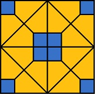

UMT Introduction
==================


UMT (Unstructured Mesh Transport) is an LLNL ASC proxy application (mini-app)
that solves a thermal radiative transport equation using discrete ordinates
(Sn).  It utilizes an upstream corner balance method to compute the solution to
the Boltzmann transport equation on unstructured spatial grids.

This class of problems is characterized by tens of thousands of unknowns
per zone and upwards of millions of zones, thus requiring large, scalable,
parallel computing platforms with tens of processors per node.

To achieve scalability, the application exploits both spatial decomposition
using message passing between nodes and a threading algorithm across angles
and energy groups across processors within the node.  More recent versions of
UMT are also capable of utilizing both CPUs and GPUs on heterogeneous platforms.

The code is primarily written in Fortran 2003 with some C++ and Cuda.

Building
===============

UMT uses the [CMake](https://cmake.org/) build system.  A MPI compiler is
required.

More information on building UMT can be found in BUILDING.md

Third party libraries
-----------------------
UMT depends on several libraries, some of them optionally. See the DEPENDENCIES.md file for more information.

Test problems
===============

UMT can run different test problems, depending on how it was configured and built.

Blueprint test problem
------------------------
UMT can dynamically generate an unstructured 2D or 3D mesh when built against Conduit
version 0.8.9 or later. This mode is selected using the -B command line argument.
Each MPI rank in UMT will construct a mesh domain by repeating a Blueprint tile topology
into a larger, repeated pattern arranged as a square tiling of the tile topology.
By default, UMT will use the tile pattern that is built into Conduit, although other
tile patterns can be supplied.



Useful command line arguments for this problem:

| Argument       | Description                                                                  |
|----------------|------------------------------------------------------------------------------|
| -B             | Selects Blueprint tiled mode. This argument is required to run this problem. |
| -d x,y,z       | Determines the number of tiles generated in X,Y,Z dimensions in each domain. The default is 10,10,10. In 2D, supply 0 for the z value. For 3D, supply a z value greater than 0. Generally, the number of zones in a domain will be equal to the product of these numbers (excluding 0's). Naturally, larger x,y,z values will result in more zones.|
| -M kdtree,none | The tiled mesh will apply some mesh zone re-ordering rules by default to try and improve memory locality. Pass a value of `none` to disable this behavior. |
| -i filename    | This option can be used to supply a Conduit .yaml or .json file containing an alternate tile definition, represented as a Blueprint topology. See Conduit/Blueprint documentation for more information on creating a new tile definition. |
| -P number      | Set a new number of polar angles. The default is 2. |
| -A number      | Set a new number of azimuthal angles. The default is 2. |
| -G number      | Set a new number of groups. The default is 2. |

Each MPI rank creates an identical mesh domain that makes up part of the whole problem. The
overall problem domain is a unit cube that is divided spatially into nx,ny,nz bricks. The
nx,ny,nz values are determined by an heuristic in UMT. Essentially, the number of MPI ranks
is factored into prime factors and these factors are multiplied round-robin in reverse
order by [nz,]ny,nz until all factors have been assigned to a dimension. The product of the
numbers is the MPI size. For MPI ranks that are prime numbers, this results in strips of
domains in Y for 2D and slabs of domains in Z for 3D. If the decomposition results in
high aspect ratio domains, then adjust the number of tiles in x,y,z using the `-d`
command line argument.

To run this problem:
1. Build UMT (MFEM is not needed)
2. Run the test driver in 3D. In the below example, the problem will run for 10 cycles. The `-d 10,10,10` argument will create a mesh domain with 10x10x10 = 1000 tiles, resulting in ~24000 zones/domain. Overall, there would be 8 times that number of zones due to running on 8 MPI ranks. The domains will be arranged in 2x2x2 layout. Run 'test_driver -h' for more info on the arguments.
```
srun -n 8 /path/to/install/bin/test_driver -c 10 -B -d 10,10,10
```
3. Run the test driver in 2D. In the below example, the problem will run for 10 cycles. The `-d 10,10,0` argument will create a 2D mesh domain with 10x10 = 100 tiles, resulting in ~2400 zones/domain. The domains will be arranged in a 2x2 layout.
```
srun -n 4 /path/to/install/bin/test_driver -c 10 -B -d 10,10,0
```

MFEM test problem
-------------------
UMT includes an unstructured mesh 3d test problem using a [MFEM](https://mfem.org/) mesh
This mesh can be refined using MFEM at run time to provide larger problems. This problem
requires UMT to have been built with MFEM support.

To run this problem:
1. Build UMT.  This will produce a test_driver and makeUnstructuredBox executable.
2. Run the makeUnstructuredBox to produce the 3d test mesh.
```
srun -n1 /path/to/install/bin/makeUnstructuredBox
```
3. Run the test driver.  In the below example the problem will run for 10 cycles and the mesh will be refined.  Run 'test_driver -h' for more info on the arguments.
```
srun -n2 /path/to/install/bin/test_driver -i ./unstructBox3D.mesh -c 10 -r 1 -R 6
```

References
==============
* Nemanic, M K, and Nowak, P. "Radiation transport calculations on unstructured
  grids using a spatially decomposed and threaded algorithm". United States: N.
  p., 1999. https://www.osti.gov/servlets/purl/14136

* Nowak, P. "Deterministic Methods for Radiation Transport: Lessons Learned and
  Future Directions." United States: N. p., 2004.
  https://www.osti.gov/servlets/purl/15014024

* Howell, Louis H., Gunney, Brian T., and Bhatele, Abhinav. "Characterization of
  Proxy Application Performance on Advanced Architectures. UMT2013, MCB,
  AMG2013." United States: N. p., 2015. Web. doi:10.2172/1224409.

* Maginot, P G, Nowak, P F, and Adams, M L. "A Review of the Upstream Corner
  Balance Spatial Discretization". United States: N. p., 2017,
  https://www.osti.gov/servlets/purl/1357379

* Thomas A. Brunner, Terry S. Haut & Paul F. Nowak "Nonlinear Elimination
  Applied to Radiation Diffusion", Nuclear Science and Engineering, 2020,
  194:11, 939-951, DOI: 10.1080/00295639.2020.1747262

* P. Nowak, A. Black, S. Rennich, D. Appelhans, R. Chen, T.  Haut, P. Maginot,
  T. Bailey, P. Brown, A. Kunen, J. Loffeld, B. Tagani, "Porting Teton, a
  Discrete-Ordinates Thermal Radiative Transfer Code, to Sierra",
  Proceedings, M&C 2019, Portland, OR, August 25-29, 2019, Pages 2128-2137

* Steven J. Plimpton, Bruce Hendrickson, Shawn P. Burns, William McLendon III &
  Lawrence Rauchwerger (2005) "Parallel Sn Sweeps on Unstructured Grids:
  Algorithms for Prioritization, Grid Partitioning, and Cycle Detection", Nuclear
  Science and Engineering, 150:3, 267-283, DOI: 10.13182/NSE150-267

* Nowak, P. "Unstructured-Mesh Deterministic Radiation Transport. Single Physics
  Package Code". Computer software. Vers. 01. USDOE. 1 May. 2013.
  LLNL-CODE-638452, https://github.com/LLNL/UMT

Release
==============
LLNL-CODE-829542
